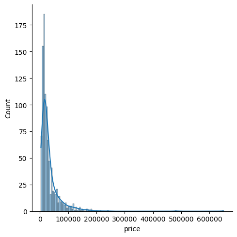
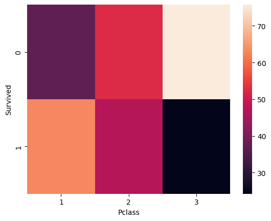
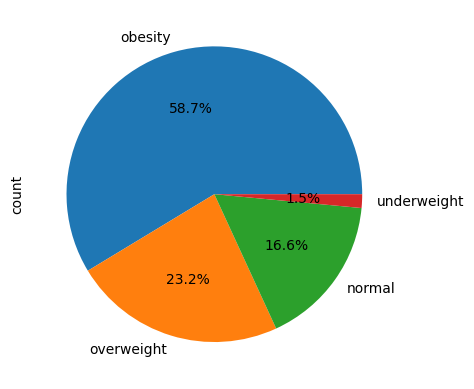
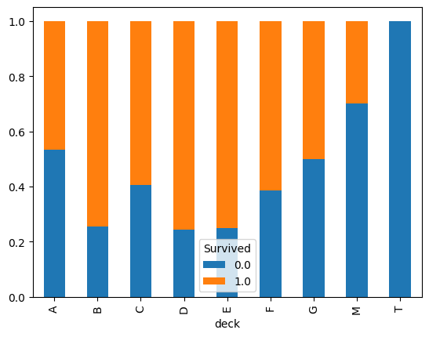

<div align="center">


</div>

<br>

<table align="center">
<tr>
<td align="center">📓<br><b>9</b><br>notebooks &amp; scripts</td>
<td align="center">🐍🗃️<br><b>2</b><br>languages</td>
<td align="center">🧹<br><b>4</b><br>cleaning pipelines</td>
<td align="center">🔎<br><b>4</b><br>EDA deep-dives</td>
<td align="center">🐞<br><b>18+</b><br>real data issues fixed</td>
</tr>
</table>

<br>

> *Anyone can run `.dropna()` and call it clean data. This repo is where I made myself find the bug that silently overwrites a column, spot the "48 lb, 27 inch" patient record that's obviously wrong, and prove I know **why** a fix works — not just that it runs.*

---

## 📑 Table of Contents
1. [What's Inside](#-whats-inside)
2. [A Few Real Bugs I Caught](#-a-few-real-bugs-i-caught)
3. [Visual Highlights](#-visual-highlights)
4. [What This Repo Taught Me](#-what-this-repo-taught-me)
5. [Structure](#-structure)
6. [Tech Stack](#-tech-stack)

---

## 🗂️ What's Inside

### 🧹 `Data-Cleaning/` — Python (Pandas)
| Notebook | The mess it starts with |
|---|---|
| **`Data_Assessing_and_Cleaning.ipynb`** | A patient/treatment healthcare dataset with 8 distinct real-world data-quality issues — misspelled names, inconsistent state formats, malformed ZIP codes, wrong data types, duplicate records, and physically implausible values (a "48 lb, 27 inch" adult patient) |
| **`Smartphone_Data_Cleaning.ipynb`** | A smartphone listings dataset where prices are stored as text and several spec values had landed in the *wrong columns entirely* (RAM/battery/camera data scattered across unrelated fields) — fixed and exported as `smartphone_cleaned_v2.csv` |

### 🔎 `EDA/` — Python (Pandas, Seaborn)
| Notebook | What it explores |
|---|---|
| **`EDA_on_Insurance_Dataset.ipynb`** | How age, BMI, smoking status, and region drive medical insurance charges — univariate, bivariate, and multivariate analysis with pair plots and violin plots |
| **`EDA_Titanic.ipynb`** | Survival patterns by class, gender, and fare — with real feature engineering: extracted passenger `title` and `deck` from raw text fields, engineered `Family_size`, `Family_type`, and `individual_fare` |
| **`Eda_on_SmartPhone_Dataset.ipynb`** | Pricing skew, brand market share, and spec-vs-price relationships across 980 phones, finished with KNN imputation for missing values |

### 🗃️ `SQL/` — Pure SQL
| Script | What it does |
|---|---|
| **`Zomato_case_study.sql`** | 13 business questions on a food-delivery schema — customer behavior, restaurant performance, delivery partner payouts |
| **`Laptopdata_cleaning_sql.sql`** | Turns messy free-text specs (`"8GB"`, `"1.5Kg"`, `"256GB SSD + 1TB HDD"`) into clean, typed columns |
| **`Eda_on_laptopdata.sql`** | Price distribution, brand comparisons, three missing-value strategies compared, feature engineering (PPI, screen-size buckets) — entirely in SQL, including ASCII histograms |
| **`casestudy_on_flights.sql`** | Builds real datetime fields from raw text, then analyzes seasonality, route duration, and pricing patterns |

### 📁 `datasets/`
Raw CSVs behind every notebook and script above.

---

## 🐞 A Few Real Bugs I Caught

Cleaning data isn't just running functions — it's catching the moment a script *looks* right but silently produces wrong numbers. A couple of examples from this repo:

```sql
-- Laptopdata_cleaning_sql.sql — caught a copy-paste bug that would have
-- silently overwritten Weight with Ram's value on every single row
❌  UPDATE laptops SET Weight = REPLACE(Ram, 'Kg', '');
✅  UPDATE laptops SET Weight = REPLACE(Weight, 'Kg', '');
```

```
-- Data_Assessing_and_Cleaning.ipynb — an adult patient record listed
-- weight as 48 lb and height as 27 inches. Nothing about the *type*
-- was wrong — the values just weren't physically plausible, which
-- only shows up if you actually look at the distribution, not just
-- the dtype.
```

These are the kind of issues that pass every `df.info()` check and every `NOT NULL` constraint — they only surface when you actually sanity-check the *values*, not just the structure.

---

## 🖼️ Visual Highlights

A few real outputs pulled straight from the notebooks above — not stock charts.

<table>
<tr>
<td width="50%">

**Smartphone prices are heavily right-skewed**
<br>A handful of ultra-premium listings pull the average far above the median.


</td>
<td width="50%">

**Titanic: 1st class passengers survived at far higher rates**
<br>Darker cells = fewer people; the survival row skews toward 1st class.


</td>
</tr>
<tr>
<td width="50%">

**Insurance dataset: BMI category split**
<br>Explored alongside charges to see which category drives the highest claims.


</td>
<td width="50%">

**Titanic: survival by deck**
<br>Built by extracting the deck letter out of the raw cabin field.


</td>
</tr>
</table>

---

## 🎓 What This Repo Taught Me

- **A dataset can pass every technical check and still be wrong.** `NOT NULL`, correct dtypes, and no duplicates don't mean the *values* make sense — the 48 lb adult patient and the corrupted `Weight` column only show up when you actually look.
- **The same cleaning logic reads differently in Pandas vs. SQL**, and knowing both means never being stuck waiting for data to be exported out of a database before I can start working with it.
- **Feature engineering is where the real insight lives** — a raw `Cabin` string is useless, but extracting `deck` from it turns "just text" into a variable that actually explains survival differences.
- **Missing values aren't one problem with one fix** — a flat mean fill, a group-mean fill, and KNN imputation all give different answers, and picking the wrong one quietly biases everything downstream.
- **Skewed distributions lie if you only look at the mean** — the smartphone dataset's mean price is nearly double its median; median + skewness + a histogram catch what a single summary stat hides.
- **Reading your own SQL back critically is part of the job** — the `Weight`/`Ram` bug above ran without a single error message; it just quietly produced wrong data.

---

## 📁 Structure

```
data-analysis/
├── Data-Cleaning/
│   ├── Data_Assessing_and_Cleaning.ipynb
│   └── Smartphone_Data_Cleaning.ipynb
├── EDA/
│   ├── EDA_on_Insurance_Dataset.ipynb
│   ├── EDA_Titanic.ipynb
│   └── Eda_on_SmartPhone_Dataset.ipynb
├── SQL/
│   ├── Zomato_case_study.sql
│   ├── Laptopdata_cleaning_sql.sql
│   ├── Eda_on_laptopdata.sql
│   └── casestudy_on_flights.sql
├── datasets/
│   └── (raw CSVs used across the above)
├── images/
│   └── (Charts and graphs)
└── README.md
```

---

## 🧰 Tech Stack

**Languages:** Python · SQL (MySQL)
**Python libraries:** Pandas, NumPy, Seaborn, Matplotlib, Scikit-learn (KNN Imputer)
**SQL techniques:** Joins, CTEs, correlated subqueries, `HAVING`, `REGEXP`, date/time functions, aggregate-based imputation

---

<div align="center">

✨ *Part of my broader portfolio — check out* [**github.com/Divya-Chital27**](https://github.com/Divya-Chital27) *for Power BI dashboards and end-to-end projects.*

</div>
